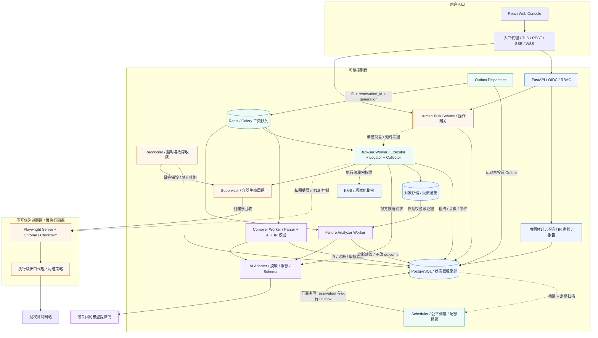
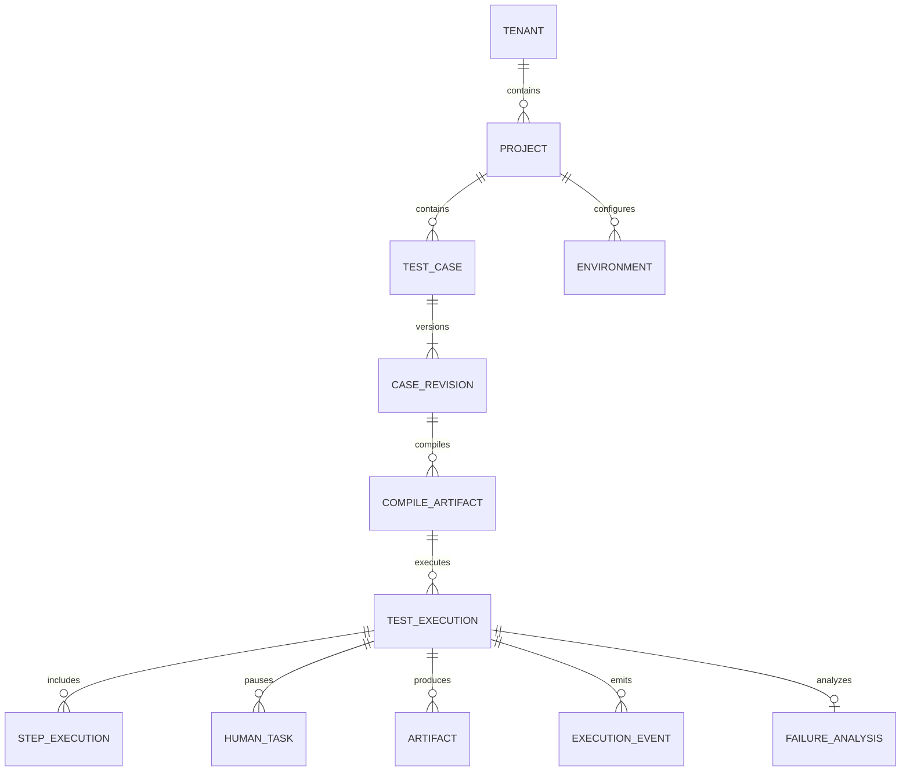
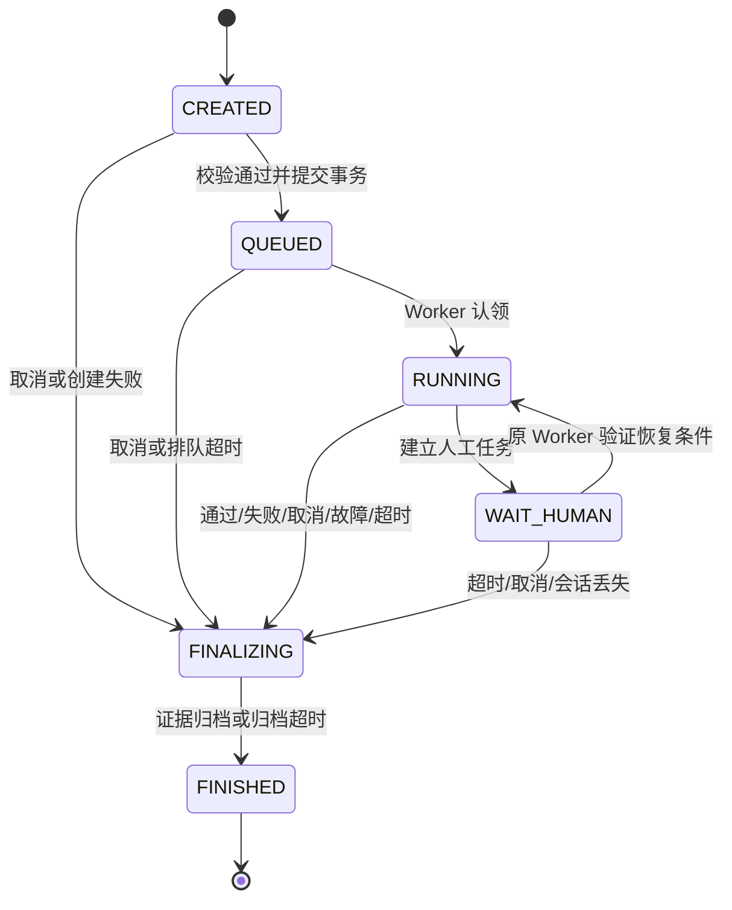
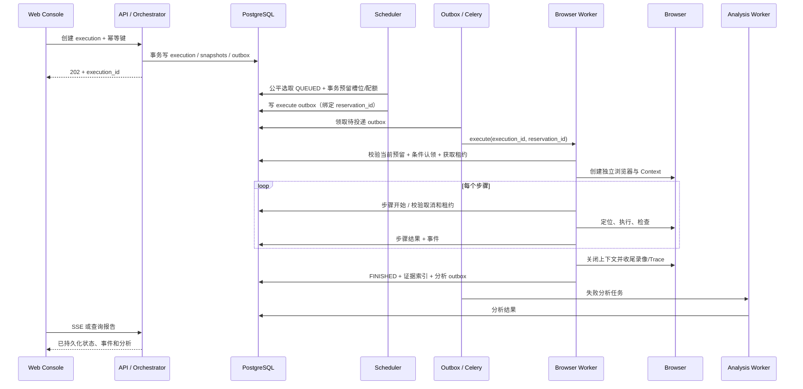

# AI Test Agent 详细设计方案

版本：V1.1（自审修订稿，尚待实现与验证）  
日期：2026-09-29  
依据：[产品需求规格说明书](./AI-Test-Agent-Product-Requirement.md)、[系统概要设计说明书](./AI-Test-Agent-System-Design.md)  
用途：作为接口定义、数据库迁移、模块实现、联调和验收的共同基线。本文是待实现的设计，不代表已有代码或已验证的性能。

本轮自审：[设计审查记录](./AI-Test-Agent-Design-Review.md)。独立架构图及可编辑源文件见 [架构图目录](./architecture/README.md)。V1.1 补充目标描述规范化、调度预留与故障收尾、证据隐私边界和身份/缓存隔离合同。

## 1. 设计范围与决策

### 1.1 目标和边界

实现“Markdown 用例 → 编译为 Test IR → 浏览器执行 → 证据报告 → 失败分析/人工协助”的完整闭环。执行过程可追踪，历史结果可复现其输入，AI 行为受到确定性规则约束。

V1 覆盖 Chrome/Chromium 下的 Web UI 测试，以及打开页面、点击、输入、清空、上传文件、等待、断言、截图八类动作。支持用例版本、标签、项目与环境、执行监控、人工接管、截图/视频/Trace 和失败分析。

V1 不支持移动 App、独立 API 测试、自动探索、自动破解验证码、任意脚本执行、跨执行自动续跑。页面产生的网络请求可作为诊断证据，但不构成 API 测试能力。

### 1.2 来源差异及统一约定

| 议题 | 来源现状 | 本方案约定 |
| --- | --- | --- |
| 交付阶段 | PRD 将 AI 分析放 Phase 2、平台能力放 Phase 3；概要设计把人工协助和分析放 Phase 3 | 使用第 17 章 M1～M4 里程碑，区分内部 MVP 与完整 V1，避免以 MVP 宣称全部需求完成 |
| 状态 | PRD 同时使用 PASSED/FAILED 与 FINISHED | 分离 `status` 生命周期与 `outcome` 测试结论；FINISHED 后仍保留结论 |
| Markdown DSL | 示例存在非标准 YAML 缩进 | 新用例使用代码块 YAML；为原示例提供有限、确定性的兼容解析 |
| 保存 Session | 未定义能否在 Worker 故障后恢复 | 人工接管保留活的浏览器进程；存储状态快照不能恢复完整页面运行现场 |
| 多用户隔离 | PRD 为安全要求，路线图较晚提供平台能力 | 从第一张表引入租户键；面向多用户开放前必须完成鉴权及隔离测试 |
| Chrome | PRD 支持 Chrome/Chromium，概要只列 Chromium | 执行配置支持两种浏览器；镜像分别安装并锁定所需浏览器版本 |
| Self Healing | 仅出现在路线图 | V1 可提出并验证定位候选，不自动修改断言、动作或已发布用例 |

### 1.3 核心技术决策

1. 沿用 React + TypeScript、Python + FastAPI、Celery + Redis、PostgreSQL、Playwright。
2. 初期采用模块化单体 API，加独立编译 Worker、浏览器 Worker、分析 Worker；不把每个逻辑模块拆成微服务。
3. PostgreSQL 是业务状态权威来源；Redis 用作消息队列和瞬时通知，不作为执行结果唯一存储。
4. 引入兼容 S3 协议的对象存储保存大文件，数据库仅保存元数据、摘要及引用。这是对概要设计的必要补充。
5. Test IR 为不可变、带版本、经过 Schema 与语义双重校验的执行合同。执行时不重新解释 Markdown。
6. 每次执行由一个浏览器 Worker 槽位完整持有，动作串行；用例之间并发。人工等待期间仍占用槽位。
7. 结构化动作确定性编译优先，AI 补充自然语言；AI 无权直接运行代码或将测试判定为成功。
8. 队列按至少一次投递设计，通过数据库幂等、租约和副作用边界控制重复消费，不承诺目标网站操作的 exactly-once。

### 1.4 需求追踪

| 需求 | 详细设计位置 | 主要验收依据 |
| --- | --- | --- |
| Markdown 上传、编辑、版本、标签 | 第 3、4、11、13 章 | 版本不可变、编辑冲突提示、原文可追踪 |
| AI 解析与 Test IR | 第 4～6 章 | 语法/语义失败定位到行；不确定输入不静默执行 |
| 八类动作与 Chrome/Chromium | 第 7 章 | 两浏览器动作契约用例全部通过 |
| 五级智能定位 | 第 8 章 | 优先级正确、多匹配不误点、AI 可关闭 |
| 并发、Worker 池、状态 | 第 9、15 章 | 重复消息不重复启动；故障有终态 |
| 验证码、OTP、人工确认 | 第 10 章 | 保留现场、单控制者、超时释放资源 |
| 证据、报告、失败分析 | 第 12 章 | 全步骤结果、证据缺失有标记、AI 有证据引用 |
| 角色、安全和环境 | 第 11、14 章 | 越权拒绝、机密不进入常规日志 |
| 插件化与未来扩展 | 第 7、18 章 | 注册式执行器，未知能力编译时拒绝 |

## 2. 总体架构与部署边界



### 2.1 职责与数据边界

| 模块 | 核心职责 | 输入 → 输出 |
| --- | --- | --- |
| Test Management | 项目、用例、修订、标签、发布校验 | Markdown → 不可变 revision |
| Markdown Parser | AST、步骤、源位置、DSL 解析 | 原文 → ParsedCase + diagnostics |
| AI Test Compiler | 自然语言补全、规范化、能力检查 | ParsedCase → CompileArtifact |
| IR Engine | Schema 版本、动作约束、变量检查 | IR → 可执行校验结论 |
| Orchestrator | 排队、配额、认领、取消、终态协调 | Execution → 分配与状态事件 |
| Playwright Executor | 浏览器生命周期与步骤执行 | IR + 环境快照 → StepResult |
| Locator Engine | 多策略定位及候选验证 | Target + 页面上下文 → LocatorResolution |
| Human Task Service | 暂停、认领、操作授权、恢复请求 | 暂停原因 → 人工任务及恢复结果 |
| Result Collector | 日志、截图、DOM、网络、Trace、视频 | 执行事件 → Artifact + 报告 |
| Failure Analyzer | 证据整理、归因建议 | 失败证据 → 结构化分析 |

入口代理负责 TLS、路由、请求体限制；业务鉴权由 API 执行。API 不持有 Playwright Page。所有队列消息仅传数据库 ID、租户键、任务类型、消息版本，不传密码、Cookie、Page 对象或原始大文件。

### 2.2 进程与浏览器模型

- 浏览器 Worker 使用 Celery prefork；每个执行任务在自身子进程内创建异步事件循环和 Playwright 对象，不跨 fork/线程复用对象。
- 一个执行任务占一个槽位；生产由 Supervisor 创建独立浏览器容器，在容器内运行匹配版本的 Playwright Server、浏览器进程和 BrowserContext，可信 Worker 通过受限私网通道连接。结束后销毁容器。池复用的是可用 Worker 槽位，V1 不跨租户复用浏览器进程；开发环境可同机模拟该边界。
- 每个执行仅允许一个活动页面；意外弹窗记录并关闭或按环境策略失败。多标签页编排、iframe 目标定位作为后续扩展，V1 检测到无法支持的目标时明确报错。
- 运行、人工等待、资源归档三个阶段均由原执行任务拥有浏览器；结束后释放槽位，AI 分析独立排队。

Playwright BrowserContext 可隔离 Cookie 和浏览器存储；本文额外采用独立浏览器进程和容器网络限制，隔离级别需由部署保障。[Playwright Isolation](https://playwright.dev/python/docs/browser-contexts)

## 3. 领域模型与用例生命周期

### 3.1 领域对象



`test_case` 保存稳定身份、名称、标签和当前修订指针；`case_revision` 保存每次保存后的原文。一次修改产生新的 revision，不覆盖历史原文。标签等非执行元数据可以独立修改并审计。

编译产物绑定 revision、DSL/IR/编译器版本、模型标识、提示词版本和输入摘要。同一修订可有多次编译，但每个执行必须引用具体 `compile_artifact_id`。模型升级不改变历史产物。

执行创建时固化环境版本、变量快照、浏览器配置、密钥版本引用、证据策略。历史可追溯指“输入和决策可检查”，不保证外部网站和过期凭证仍可重现。

### 3.2 编辑、编译与执行约束

1. 上传或保存先完成 UTF-8、大小、基本 Markdown 结构检查，再新增修订。
2. 保存使用 `If-Match`/版本号做乐观锁；冲突返回 409，前端显示差异，不覆盖他人修改。
3. 编译为异步任务，状态为 `PENDING/RUNNING/SUCCEEDED/NEEDS_REVIEW/FAILED`。
4. 完整结构化 DSL 校验成功可直接成为 SUCCEEDED；由 AI 补全的动作或目标进入 NEEDS_REVIEW，用户确认 IR 与原文对应关系后可执行。
5. 新修订不会自动替换正在运行任务的输入。归档用例阻止新执行，不删除历史报告。
6. 运行必须选择环境，并通过目标域名、附件权限、必填变量、密钥权限与浏览器能力检查。

## 4. Markdown DSL 详细设计

### 4.1 标准格式

文件使用 UTF-8；一级标题为用例名，二级标题 `Step N` 定义顺序步骤。可选 YAML front matter 定义 DSL 版本、标签、变量声明及默认超时。每步恰好选择一个 `yaml` 代码块或自然语言描述，禁止同一步混用两种执行定义。

````markdown
---
dsl_version: "1.0"
tags: [smoke, login]
variables:
  username:
    type: string
    required: true
defaults:
  timeout_ms: 10000
---
# 登录测试

## Step 1
```yaml
action: open
url: "${env.base_url}/login"
```

## Step 2
```yaml
action: input
target:
  description: 用户名输入框
  type: input
  role: textbox
  name: 用户名
value: "${vars.username}"
```

## Step 3
```yaml
action: input
target:
  description: 密码输入框
  type: input
  css: 'input[name="password"]'
value: "${secrets.login_password}"
```

## Step 4
```yaml
action: click
target:
  description: 登录按钮
  type: button
  role: button
  name: 登录
```

## Step 5
```yaml
action: assert
condition:
  kind: page_contains
  expected: 欢迎回来
```
````

### 4.2 语法、限制与兼容

| 项目 | 规则 |
| --- | --- |
| 标题 | 一个一级标题；步骤编号从 1 连续递增且唯一；内部稳定 `step_id` 由编译器生成 |
| 大小 | 建议默认原文 ≤ 256 KiB、步骤 ≤ 200、单字段 ≤ 16 KiB，可由管理员调整 |
| YAML | 安全解析，禁用自定义 tag、对象构造与 alias/anchor，限制嵌套深度；未知执行字段直接报错 |
| 自然语言 | `## Step N` 下的普通文字；AI 转换后必须确认；不从背景说明自动增加步骤 |
| 变量 | 只允许 `${env.name}`、`${vars.name}`、`${secrets.name}`；无函数、表达式、递归替换或代码求值 |
| 类型 | 变量声明类型与动作字段类型一致；秘密只能用于允许的输入字段，不能拼入 URL、selector 或日志标签 |
| 超时 | 步骤显式值优先于 defaults，最终受系统上限约束；不能填负值或无限等待 |
| 附件 | 上传动作只能引用项目内已扫描通过的 `attachment_id`，不能引用 Worker 任意路径 |
| 兼容 | 未声明 dsl_version 的文档进入 `legacy-prd-v1` 解析模式并显示迁移提示 |

兼容解析按 Step 边界识别原 PRD 中 `action:`、`url:`、`target:`、`value:`、`condition:` 字段；允许 `url:`/`value:` 的值在下一非空行，允许 `condition:` 后按已知 `page_contains:` 及其下一行的值折叠成标准条件。保留源行号，不把整个文档当作 YAML，也不以通用缩进修复猜测含义。重复字段、多个可能值或未知格式产生 `DSL_AMBIGUOUS_SYNTAX`，要求用户修改。

### 4.3 解析流程与诊断

`字节校验 → Markdown AST → front matter → Step 分组 → 结构化/自然语言分类 → 字段解析 → ParsedCase → Schema/语义检查`。

诊断包含 `code/severity/message/step_id/source_range/field/suggestion`。原文永久保存在修订中；步骤保存原文切片及行列映射。编译错误不创建执行任务。

```json
{
  "code": "DSL_MISSING_FIELD",
  "severity": "ERROR",
  "message": "input 动作缺少 value",
  "step_id": "s2",
  "source_range": {"start_line": 12, "end_line": 18},
  "field": "value",
  "suggestion": "填写常量、变量或密钥引用"
}
```

## 5. Test IR 合同

### 5.1 顶层结构

以下为第 4.1 节五步登录用例对应的合同示例；正式开发时用 Pydantic 判别联合模型导出 JSON Schema，并将生成文件纳入版本控制。UUID 与版本为说明值；源行号、源切片及摘要按上文代码块内容计算（LF 换行、末尾不追加换行）。

```json
{
  "ir_version": "1.0",
  "case_revision_id": "00000000-0000-4000-8000-000000000001",
  "source_digest": "sha256:5e932a0eab2e70cb85733fa3efb66629c776ebf23826e85b43cc6772de14e7c6",
  "compiler": {
    "version": "1.0.0",
    "mode": "deterministic"
  },
  "variables": {
    "username": {
      "type": "string",
      "required": true
    }
  },
  "defaults": {
    "timeout_ms": 10000
  },
  "steps": [
    {
      "id": "s1",
      "action": "open",
      "source": {
        "start_line": 13,
        "end_line": 17,
        "text": "## Step 1\n```yaml\naction: open\nurl: \"${env.base_url}/login\"\n```"
      },
      "url": {
        "kind": "template",
        "template": "${env.base_url}/login"
      },
      "wait_until": "domcontentloaded"
    },
    {
      "id": "s2",
      "action": "input",
      "source": {
        "start_line": 19,
        "end_line": 28,
        "text": "## Step 2\n```yaml\naction: input\ntarget:\n  description: 用户名输入框\n  type: input\n  role: textbox\n  name: 用户名\nvalue: \"${vars.username}\"\n```"
      },
      "target": {
        "description": "用户名输入框",
        "type": "input",
        "candidates": [
          {
            "strategy": "role",
            "role": "textbox",
            "name": "用户名",
            "exact": true
          }
        ]
      },
      "value": {
        "kind": "variable",
        "namespace": "vars",
        "key": "username"
      }
    },
    {
      "id": "s3",
      "action": "input",
      "target": {
        "description": "密码输入框",
        "type": "input",
        "candidates": [
          {
            "strategy": "css",
            "selector": "input[name=\"password\"]"
          }
        ]
      },
      "value": {
        "kind": "secret",
        "key": "login_password"
      },
      "source": {
        "start_line": 30,
        "end_line": 38,
        "text": "## Step 3\n```yaml\naction: input\ntarget:\n  description: 密码输入框\n  type: input\n  css: 'input[name=\"password\"]'\nvalue: \"${secrets.login_password}\"\n```"
      }
    },
    {
      "id": "s4",
      "action": "click",
      "source": {
        "start_line": 40,
        "end_line": 48,
        "text": "## Step 4\n```yaml\naction: click\ntarget:\n  description: 登录按钮\n  type: button\n  role: button\n  name: 登录\n```"
      },
      "target": {
        "description": "登录按钮",
        "type": "button",
        "candidates": [
          {
            "strategy": "role",
            "role": "button",
            "name": "登录",
            "exact": true
          }
        ]
      }
    },
    {
      "id": "s5",
      "action": "assert",
      "source": {
        "start_line": 50,
        "end_line": 56,
        "text": "## Step 5\n```yaml\naction: assert\ncondition:\n  kind: page_contains\n  expected: 欢迎回来\n```"
      },
      "condition": {
        "kind": "page_contains",
        "expected": "欢迎回来"
      },
      "timeout_ms": 10000
    }
  ]
}
```

此 IR 与第 4.1 节五个步骤逐一对应，含密码秘密引用；`source.text` 为原文切片。示例摘要用于检查文档一致性，实际上传必须对约定的原始字节或统一换行策略计算摘要，不能混用两种口径。

### 5.2 字段与兼容约束

| 对象 | 字段 | 约束 |
| --- | --- | --- |
| TestIR | ir_version、case_revision_id、source_digest、compiler、steps | 全部必填；steps 非空且顺序固定 |
| Step 基类 | id、action、source、timeout_ms?、human_policy? | id 唯一；action 为八种枚举；所有动作均可携带人工策略 |
| Target | description、type?、candidates、allow_vision? | description 必填；无静态候选时需启用视觉或报缺少定位条件 |
| LocatorCandidate | strategy 及对应字段 | css: selector；role: role/name/exact；text: text/exact；xpath: selector |
| ValueSpec | kind 及对应字段 | literal: value；variable: namespace/key；template: template；secret: key；类型互斥 |
| Source | start_line、end_line、text | 起止合法，必须落在对应 revision 原文中 |
| HumanPolicy | mode、reason?、resume_condition? | mode 为 disabled/on_challenge/before；恢复条件使用确定性 Condition |

DSL 的 `css/role/name/text/xpath` 统一编译到 `candidates`。`${secrets.name}` 编译为 `{"kind":"secret","key":"name"}`，不包含明文。环境和用户变量在创建执行时解析，密钥由执行器按冻结版本在使用前获取。

仅包含 description/type 的原 PRD 目标进入“目标规范化”阶段：编译器可将明确的控件类型和名称转换为待审核的 role/name 或 text 候选，例如“登录按钮”→ button/登录；不得凭描述臆造 CSS/XPath。可访问名称不明确时产生 `TARGET_NEEDS_LOCATOR` 诊断，要求用户补充；项目允许视觉时可保留 description-only 候选并注明依赖视觉。由 AI 推导的候选一律 NEEDS_REVIEW；候选在编译时未接触目标页面，实际存在性仍由运行时验证。编译不需要调用目标网站。

所有模型禁止额外字段。未知动作、未知字段、未声明变量、不支持的条件或超限参数一律拒绝。`ir_version` 主版本不兼容时执行器拒绝执行，升级需重新编译产生新产物。

### 5.3 Condition 合同

| kind | 字段 | 成功判定 |
| --- | --- | --- |
| page_contains | expected | 主页面可见正文经空白归一化后包含 expected，区分大小写 |
| url_equals | expected | 当前 URL 与解析后的 expected 严格相等 |
| url_contains | expected | 当前 URL 包含固定文本；不支持任意正则 |
| element_visible | target | 唯一目标可见 |
| element_hidden | target | 目标不存在或不可见；多个匹配仍视为歧义 |
| text_equals | target、expected | 唯一目标可见文本空白归一化后相等 |
| value_equals | target、expected | 唯一表单控件当前值严格相等 |

同一 Condition 用于 `assert`、`wait` 和人工恢复检查。V1 不支持任意 JavaScript predicate。AI 视觉不能作为业务断言成功的唯一依据。

条件查询与动作定位采用不同校验模式：动作目标要求可见且可操作；`element_hidden` 查询允许零匹配或唯一不可见匹配，不能先经过“必须可见”的动作校验。查询结果也不能触发视觉点击或自修复。断言和恢复条件只使用已定义的确定性候选；缺少此类候选在编译时拒绝。

对于 element_hidden，必须检查全部已配置候选：任一候选指向可见目标则继续等待，任一候选多匹配则返回歧义；全部候选为零匹配或唯一不可见时才成立。禁止以失效 CSS 的零匹配跳过仍可见的 Role 目标；该负向断言不读取可变 Element Memory。若业务要求“曾出现后消失”，必须先执行 element_visible，避免未加载完成就通过。

## 6. AI Test Compiler 设计

### 6.1 编译流水线

1. Parser 提取结构与源位置；完整结构化步骤直接归一化，description-only 目标按第 5.2 节补充规范化，不能直接视为完整定位器。
2. 对自然语言步骤构造受限请求：动作枚举、IR Schema、该步骤原文、非秘密变量声明和少量相邻上下文。
3. AI 只返回指定结构，不生成 Python、JavaScript、shell 或额外步骤。
4. 验证输出 Schema、动作数量、源文本映射、变量、附件、URL 策略、执行器能力。
5. 结构校验失败最多修正请求一次；语义缺失如目标或断言期望不明确，返回待用户补充的诊断，不自行补写业务事实。
6. 保存输入摘要、提示词版本、模型、耗时、token/费用记录和产物。自然语言产物经用户确认后转为可执行状态。

### 6.2 幂等与降级

- 编译产物去重键包含 tenant_id、project_id、case_revision_id、source_digest、编译器版本、模型配置、提示词版本、IR Schema 版本；产物始终绑定原 revision。缓存命中不复用其他项目的权限、密钥/附件引用或确认记录。同内容的新修订仍生成独立产物；可复用内部纯解析结果，但必须重新绑定源位置、资源引用并执行权限与语义校验。
- 模型超时或不可用时，完整 DSL 仍可确定性编译；需要 AI 的步骤返回 `AI_UNAVAILABLE`，不发布部分 IR。
- `NEEDS_REVIEW` 页面展示原文与生成动作差异，接受动作记录确认人和时间；修改原文后需要重新编译。
- 编译预算建议：每个任务最多两次模型调用、总时长 60 秒；具体限额由项目配额和提供商能力配置。

### 6.3 AI 安全边界

网页内容、用例内容和模型输出均视为数据。页面中“忽略指令、打开内部地址、导出 Cookie”等文本不能更改系统策略。模型只能建议已声明动作、候选定位器或分析结论；所有 URL、文件、目标、权限再次由确定性代码验证。模型参数、费用和置信度只用于诊断，不能替代执行前校验。

## 7. 执行器与动作设计

### 7.1 模块接口

以下为接口草图，方法和类型用于明确边界，不是可直接运行的实现。

```python
class ExecutorAdapter(Protocol):
    def capabilities(self) -> CapabilitySet: ...
    async def create_session(self, config: SessionConfig) -> Session: ...
    async def execute_step(self, session: Session, step: StepIR,
                           context: RunContext) -> StepResult: ...
    async def collect_evidence(self, session: Session,
                               policy: EvidencePolicy) -> EvidenceBundle: ...
    async def close_session(self, session: Session) -> None: ...

class LocatorEngine(Protocol):
    async def resolve(self, target: Target, context: RunContext,
                      deadline: float) -> LocatorResolution: ...
```

动作处理器按 `action → handler` 注册。编译器和执行器共用能力声明；浏览器会话、变量解析、租约检查、日志脱敏、证据采集由执行上下文注入，处理器不自行获取其他租户资源。

### 7.2 八类动作语义

| action | 必填/可选参数 | Playwright 映射或实现 | 完成条件 |
| --- | --- | --- | --- |
| open | url；wait_until? | `page.goto`，默认 domcontentloaded | 到达允许地址并满足导航等待；默认主文档 4xx/5xx 失败，可由环境显式放宽 |
| click | target | 唯一 locator 的 `click` | 点击动作完成；业务结果由下一断言检查 |
| input | target、value | `locator.fill` | 替换原内容；控件值与输入一致，秘密值只比较不输出 |
| clear | target | `locator.fill("")` | 控件值为空 |
| upload | target、attachment_ids | 下载到执行临时目录后 `set_input_files` | 文件控件接收文件；服务端上传成功需单独断言 |
| wait | condition 或 duration_ms（二选一） | Condition 轮询或有界延迟 | 条件达成或延迟结束；固定等待上限建议 10 秒 |
| assert | condition | 确定性条件检查与有界重试 | 条件在超时前成立；否则 ASSERTION_FAILED |
| screenshot | name?、full_page? | 截图并登记 Artifact | 必需截图成功持久化；失败返回 EVIDENCE_CAPTURE_FAILED |

Chrome 使用对应浏览器 channel，Chromium 使用锁定的配套浏览器；创建执行时固化 `browser_type/browser_version/viewport/locale/timezone`。默认关闭忽略 TLS 错误，允许在受控测试环境单独配置。

### 7.3 执行步骤的顺序

`校验租约与取消 → 建立 step RUNNING 记录 → 解析变量/密钥 → 必要时暂停人工 → 定位 → 提交动作 → 条件验证 → 采集证据 → 落库步骤终态 → 发布事件`。

每步记录 `started_at/ended_at/duration_ms/action/locator_attempts/error_code/artifact_ids`。失败后默认 fail-fast，剩余步骤标记 SKIPPED；V1 不支持 continue-on-error，以免后续运行掩盖前置失败。

副作用动作另记录 `dispatch_state=NOT_STARTED/INTENT_RECORDED/ACKNOWLEDGED`：调用浏览器前先持久化 INTENT_RECORDED，调用返回后更新 ACKNOWLEDGED。若在两者之间故障，无法仅凭数据库判断动作是否发生，按结果未知处理；该日志用于保守判定，不提供目标网站事务保证。

### 7.4 等待、重试与副作用

- 采用单一步骤截止时间，所有定位策略共享剩余时间，不为每个候选重新分配完整超时。
- Locator 自动等待及只读条件轮询属于同一步内部等待；不计为业务动作重试。
- `click/input/clear/upload/open` 一旦可能触发页面副作用，不因响应超时或数据库写入失败而自动重复。导航也可能触发目标系统业务变化。
- 动作执行前失败，如浏览器尚未启动，可安全重试任务初始化。动作提交后状态不明则报告 `ACTION_OUTCOME_UNKNOWN`，停止执行。
- 整个用例重跑由用户显式发起，创建新 execution 并关联 `retry_of_execution_id`；原记录保持不变。
- 每个浏览器调用必须有超时；取消信号由并发监视协程接收，关闭该执行的浏览器可中断挂起调用。取消无法撤销已提交的目标业务操作。

## 8. Locator Engine 设计

### 8.1 定位顺序与候选校验

严格按 CSS Selector → Accessibility Role → Text → XPath → AI 视觉降级，未提供某种候选则跳过。每级候选都必须通过唯一性、可见性、控件类型和动作可执行性检查。

```text
for strategy in [css, role, text, xpath, vision]:
    校验剩余时间、租约、取消、策略许可
    获取当前策略候选（显式配置优先，其次已批准记忆）
    在当前页面验证候选
    0 个匹配：尝试下一候选/策略
    1 个合法匹配：返回定位结果
    多个匹配或候选指向冲突元素：记录歧义，禁止取 first()
无法获得唯一合法目标：LOCATOR_NOT_FOUND 或 LOCATOR_AMBIGUOUS
```

出现歧义时后续策略只有通过同一目标的属性约束验证才可消歧；存在相互矛盾的唯一候选时失败或请求人工，不用低优先级结果掩盖冲突。定位结束与动作执行间若 DOM 变化导致失效，可在尚未提交动作的前提下重新定位，仍受同一步截止时间限制。

确定性候选采用有界轮询，每轮按既定优先级快速检查，不让一个失效 CSS 耗尽整步时间。启用视觉时默认总步骤预算为 20 秒，其中确定性定位最多 5 秒、视觉最多 10 秒，至少保留 5 秒用于候选验证和动作；显式更短的 timeout 不被暗中延长，预算不足时跳过视觉并记录原因。若多个已验证候选之间出现冲突，需先解决冲突再返回，不在检查已知冲突前直接操作。

### 8.2 AI 视觉降级

1. 前四级失败且项目启用视觉时，截取当前视口并去除可识别秘密区域。
2. 发送目标描述、动作类型、图片尺寸与视口上下文，限制模型只输出候选框/元素描述。
3. 将候选映射到当前 DOM，检查位置、可见性、遮挡、类型、唯一性和页面版本；若截图后发生导航则废弃候选。
4. 仅返回通过 DOM 验证的 locator。V1 对纯 canvas 或无法映射 DOM 的坐标目标请求人工，不执行无验证坐标点击。
5. 保存已脱敏输入引用、候选、验证结果和耗时。每步最多一次视觉调用，默认预算 10 秒且不得超过步骤剩余时间。

密码、OTP、Token 等不可见于提供商输入；无法可靠遮挡时跳过视觉，返回定位失败或进入允许的人工流程。

### 8.3 Element Memory 与 Self Healing

记忆键至少包含 `tenant_id/project_id/environment_id/origin/route_pattern/target_fingerprint/browser_family`。记录 selector、策略、目标属性指纹、验证次数、成功次数、失败次数、最近使用时间、应用版本及批准状态。

记忆是候选缓存，使用前必须在当前页面重新验证。已有显式 CSS 不被记忆静默覆盖；连续失效候选进入失效状态。`success_rate` 由计数计算，样本少时不能仅按比例排序。

Self Healing 只生成变更建议与验证证据。采纳建议后产生新用例修订并重新编译；禁止自动改动断言期望、URL 目标域或业务步骤。定位成功与业务断言成功分别统计，不能将“找到了元素”视为“测试通过”。

## 9. 调度、状态机与故障恢复

### 9.1 执行状态模型

`status`：`CREATED/QUEUED/RUNNING/WAIT_HUMAN/FINALIZING/FINISHED`。  
`outcome`：`null/PASSED/FAILED/CANCELLED/TIMED_OUT/ERROR`。  
`analysis_status`：`NOT_REQUIRED/PENDING/RUNNING/SUCCEEDED/FAILED`。  
`artifact_status`：`PENDING/COMPLETE/PARTIAL/FAILED`。

PASSED/FAILED 是测试结论，FINISHED 是生命周期终态。前端展示“执行完成 · 失败”等组合；PRD 的原状态语义通过该映射保留。



| 转移 | 前置条件 | 原子写入内容 |
| --- | --- | --- |
| CREATED → QUEUED | IR 已通过、环境与权限通过 | 快照、排队时间、版本号、execution.queued 唤醒 Outbox（不是直接执行消息） |
| QUEUED → RUNNING | 执行未取消、匹配当前 reservation、Worker 能力匹配、无有效持有者 | 预留转 ACTIVE、owner_worker_id、租约 epoch、lease_until、started_at、事件 |
| RUNNING → WAIT_HUMAN | 允许人工策略、没有未完成人工任务 | human_task、暂停位置、pending_step、暂停预算、事件 |
| WAIT_HUMAN → RUNNING | 有效恢复请求、人工操作已停止、条件通过、会话存活 | 人工任务完成、步骤恢复策略、状态版本、事件 |
| 活动态 → FINALIZING | 唯一终止原因已确定 | outcome、error_code、剩余步骤状态、终止人工任务、事件 |
| FINALIZING → FINISHED | 必需关闭动作完成或归档截止 | ended_at、artifact_status、报告摘要、分析 Outbox；仅清理确认后释放配额，否则预留转 QUARANTINED |

状态更新使用当前状态、`state_version`、`lease_epoch` 条件更新，影响行数为零表示并发冲突。FINISHED 和已确定 outcome 不可被迟到消息覆盖。分析失败不把 PASSED 改为 FAILED。

步骤状态为 `PENDING/RUNNING/WAIT_HUMAN/PASSED/FAILED/SKIPPED/CANCELLED/ERROR`；失败步骤之后的 PENDING 步骤转为 SKIPPED，取消中的活动步骤转为 CANCELLED。执行级基础设施故障使用 ERROR，业务断言或明确动作失败使用 FAILED。

### 9.2 端到端时序



### 9.3 队列与资源控制

分设 `compile/execution/analysis` 队列；人工控制不排入可能阻塞的 execution 队列，而是写持久化 `execution_command`，通知只用于加速唤醒。原 Worker 每秒检查命令并在适当动作边界处理。

Orchestrator 先将 QUEUED 任务保存在数据库，由独立 Scheduler 按租户轮询公平选取任务。创建执行的事务只发调度唤醒事件；只有 Scheduler 在同一事务成功创建 `execution_reservation` 后才能产生 execute Outbox。预留状态为 RESERVED/ACTIVE/QUARANTINED/RELEASED，前三者均计入租户、项目和物理 Worker 池配额；事务按租户→项目→池的固定顺序加锁，防止超配和死锁。重投同一 reservation 不重复计费。

reservation 记录 `execution_id/pool_id/generation/expires_at`；执行消息必须携带 reservation_id/generation。建议未启动预留 60 秒过期，巡检与 Worker 认领争抢同一行锁：只有未认领预留可回收后再排队。旧消息发现预留已撤销或 generation 不符即确认并退出。ACTIVE 预留由执行租约接管，不能按排队过期时间误回收。即使 Redis 丢失已发送消息，Scheduler 仍从 DB 的未认领预留和 QUEUED 状态恢复调度。

建议 `worker_prefetch_multiplier=1`、执行任务使用延迟确认；具体 worker_lost 行为结合故障测试确定。Celery 确认与重投并不能提供 exactly-once，应用层必须识别重复任务。[Celery Tasks](https://docs.celeryq.dev/en/stable/userguide/tasks.html)

Redis visibility timeout 必须大于执行任务的完整硬时限，包括人工等待及归档时间；broker/result backend/app 对应配置保持一致。延长它会增加某些故障后的重投等待，因此业务恢复依靠数据库巡检，不能只等待队列超时。[Celery Redis Caveats](https://docs.celeryq.dev/en/stable/getting-started/backends-and-brokers/redis.html)

### 9.4 Outbox、幂等与租约

- 创建执行、改变业务状态及相应 Outbox 写入同一 PostgreSQL 事务。Dispatcher 成功投递后标记已发送；崩溃导致重复投递由消费者幂等处理。
- 用户创建执行必须带 `Idempotency-Key`；作用域为租户、用户、路由。相同键与相同请求摘要返回同一执行，摘要不同返回 409。建议保存 24 小时。
- Worker 认领时生成单调递增 `lease_epoch`，每 5 秒续约，建议 30 秒到期。续约失败立即停止发出新浏览器动作，取消正在等待的调用并关闭浏览器。
- 每个步骤事件和状态写入携带 epoch。重复消息若发现有效租约或终态，仅确认消费，不启动第二个浏览器。
- 租约过期且执行从未进入 RUNNING 可重新调度；已经启动过浏览器的执行保守结束为 ERROR/SESSION_LOST，不转移到新 Worker 接着执行。
- 数据库 fencing 只能阻止旧 Worker 写回，不能撤销已发往目标网站的请求。巡检器应经容器运行时/Worker 监督进程停止旧浏览器，不能据租约超时就假定外部副作用已停止。
- 终止旧进程未确认时记录 `cleanup_status=QUARANTINED`，扣留槽位、禁止自动重跑，并由运维处理；目标业务状态可能需要人工核对。

独立 Reconciler 处理过期 RUNNING/WAIT_HUMAN 以及超时 FINALIZING：事务提高 lease_epoch 撤销旧写入权，保留已确定的 outcome；缺失 outcome 时使用 ERROR/SESSION_LOST。它只执行浏览器终止、证据索引收尾、任务关闭等幂等清理，绝不执行剩余测试步骤。即使原 Worker 已死亡也必须在归档截止后写 FINISHED，缺失证据记 PARTIAL；未确认释放的资源保留 QUARANTINED reservation，待 Supervisor 确认销毁后再释放配额。数据库不可用期间本地先关闭浏览器，数据库恢复后再协调收敛，不承诺离线即时写终态。

### 9.5 时间预算与取消竞争

以下为可调整的建议默认值，使用单调时钟计算本进程时长，数据库 UTC 时间用于跨进程租约与截止时间。

| 预算 | 默认建议 | 语义 |
| --- | --- | --- |
| queue_timeout | 10 分钟 | 超时尚未开始则 TIMED_OUT，不能永远排队 |
| step_timeout | 常规 10 秒；导航 30 秒；视觉目标默认 20 秒 | 显式 defaults/步骤配置优先；定位、动作和检查共享；上限 120 秒 |
| active_timeout | 10 分钟 | 累计 RUNNING 时间，不含人工等待 |
| human_wait_timeout | 每次 5 分钟 | 每执行最多 2 次，累计 ≤ 10 分钟 |
| finalization_timeout | 60 秒 | 尽力收尾，缺失证据标 PARTIAL |
| task_hard_limit | 25 分钟 | 从 Worker 接手计时，覆盖以上预算并留清理余量 |
| visibility_timeout | 30 分钟 | 应大于 task_hard_limit；变更时联动检查 |

取消请求写入 `cancel_requested_at` 和 command，不直接伪造 FINISHED。Worker 与取消 API 竞争最终结论时以数据库条件更新的提交先后为准：若终态已确定返回当前结论；若取消先被接受，Worker 在下一个检查点进入取消收尾。浏览器隔离进程无法响应时通过监督进程终止，报告标注未能确认的步骤。

### 9.6 故障处理矩阵

| 故障 | 行为 | 用户可见结果 |
| --- | --- | --- |
| DB 已提交、消息未发出 | Outbox 重投 | 保持 QUEUED，可观察调度延迟 |
| 同一消息重复到达 | 检查租约/终态后忽略重复 | 同一 execution 仅一个持有者 |
| Browser 启动前失败 | 初始化最多重试 2 次，退避 1/3 秒 | 最终 ERROR/BROWSER_START_FAILED |
| Browser 运行中崩溃 | 停止后续步骤，保留已上传证据 | ERROR/BROWSER_CRASHED |
| Worker 丢失 | 租约巡检、终止旧进程、不续跑 | ERROR/SESSION_LOST |
| Worker 在 FINALIZING 时死亡 | Reconciler 撤销旧租约、保留 outcome、幂等清理并结束 | FINISHED；证据缺失与隔离资源单独标记 |
| DB 暂时不可写 | 停止新动作，内存/受限临时盘缓冲诊断；失败后终止 | ERROR/STATE_STORE_UNAVAILABLE |
| Redis 不可用 | 已运行任务通过 DB 接收控制；新任务等待重投 | 调度延迟，不丢失执行请求 |
| 对象存储不可用 | 有界上传重试；临时盘限额；归档截止后结束 | artifact_status=PARTIAL/FAILED |
| AI 不可用 | 结构化编译、常规定位与执行继续；AI 分析单独失败 | 显示 AI_UNAVAILABLE，可重做分析 |

## 10. 人工协助详细设计

### 10.1 触发与可控范围

触发来源为用例 `human_policy.mode=before`、项目配置的验证码/OTP 确定性检测规则，或操作员主动请求暂停。AI 可提示疑似挑战，但不能单独宣告已通过验证码。V1 只承诺已配置挑战类型，未知验证码页面可能以超时失败，报告给出人工重跑入口。

人工协助处理验证码、OTP 和明确业务确认；不提供自动识别验证码、代收短信或读取邮箱能力。前端显示当前页面、暂停原因、剩余时间、可执行操作和负责人员。

### 10.2 活会话与接管方式

浏览器 Worker 保留原进程、Context、Page 和页面 JavaScript 内存。可保存加密 storage_state 作为授权的登录状态辅助，但它不等于完整浏览器检查点，不能恢复当前 DOM、网络请求或所有内存状态。Playwright 的认证状态 API 用于复用特定浏览器存储，不能据此承诺进程故障后的无缝续跑。[Playwright Authentication](https://playwright.dev/python/docs/auth)

V1 采用项目内的受限远程浏览器操作：Worker 采集视口画面，通过人工操作网关转发；用户发送点击、键盘输入、滚动命令，由原 Worker 串行执行。OTP 可用专门的瞬时输入框提交。需要原生浏览器窗口或系统文件对话框的挑战明确标为不支持。

- 授权令牌为一次性短时票据，绑定 user、tenant、execution、human_task、session_epoch、用途，建议有效期 60 秒；连接后按短租约续权。
- 不向用户或公网暴露 CDP、VNC、Playwright 调试端口。网关只路由已授权 execution。
- 每次人工命令包含单调序号和最新 `frame_id`，坐标校验视口尺寸；过时画面拒绝点击并刷新，防止误操作。
- 人工输入和自动化动作共享同一会话互斥锁。进入 WAIT_HUMAN 后停止自动动作，恢复前撤销操作票据并排空人工命令。
- 同时只有一名控制者；其他人仅能在有权限时查看。OTP、密码键入内容不记录，审计只保留操作类型、操作者和时间。

### 10.3 人工任务状态与恢复语义

状态：`PENDING/CLAIMED/RESUME_REQUESTED/COMPLETED/EXPIRED/CANCELLED`。

1. Worker 在可暂停边界保存当前 step、页面 URL 摘要、会话 epoch、暂停阶段和 `resume_condition`，事务创建人工任务并进入 WAIT_HUMAN。
2. 操作员通过 CAS 认领，获得控制租约；断线释放控制但保留任务，重新认领不延长任务总截止时间。
3. 点击“完成处理”创建恢复 command，任务进入 RESUME_REQUESTED，API 返回 202，不立即声称已经恢复。
4. 原 Worker 停止人工输入、验证租约和页面存活、检查明确的恢复条件。
5. 条件未通过时退回 CLAIMED 并提示原因；通过时任务完成、执行转回 RUNNING。
6. 超时转 EXPIRED，执行 TIMED_OUT/HUMAN_WAIT_TIMEOUT；会话丢失转 CANCELLED 并以 ERROR/SESSION_LOST 结束执行。

恢复策略必须在暂停时确定：

| 暂停位置 | 恢复行为 |
| --- | --- |
| 动作提交之前（before_action） | 人工仅处理前置条件，恢复后执行原动作一次 |
| 动作已提交后出现挑战（after_action） | 人工处理挑战；恢复后仅验证完成条件并进入下一步，不重新点击 |
| 无法确定动作是否提交 | 不自动恢复，结束为 ACTION_OUTCOME_UNKNOWN，由用户决定是否新建重跑 |

每次暂停生成唯一 `pause_token`，恢复事务将其记为已处理并推进步骤内阶段；同一步的 before_action 人工策略只触发一次，重复恢复消息不能重新暂停或重发动作。暂停后为人工配置的恢复检查使用独立有界预算；恢复自动执行时保留暂停前的步骤剩余时间，人工等待不耗用该时间。

`human_policy.mode=before` 用于人工确认时，可由操作者明确确认前置操作已完成；验证码/OTP 自动暂停必须设置可验证恢复条件，例如挑战消失且预期页面元素出现。平台不自动把人工点击成功当作业务断言通过。

### 10.4 配额与证据

WAIT_HUMAN 占用浏览器资源及租户并发额度，建议人工等待槽位不超过总槽位的 25%；超出时不再自动进入长时间等待，而按项目策略结束并提示重跑，避免挤占全部执行资源。

执行创建时确定证据模式：NORMAL 或 SENSITIVE。包含秘密引用、预配置人工协助或敏感目标环境时默认 SENSITIVE，从 Context 创建起关闭原始 Trace/视频，只保留受控的脱敏日志与遮挡截图。人工操作画面仅对当前获授权的控制者短时传输，不默认落盘或发给模型。

NORMAL 执行中意外进入敏感人工流程时，在发放控制票据和接收输入之前调用完整 `tracing.stop()` 并停用屏幕采样，不把 `stop_chunk()` 当作停止所有敏感采集的保证。已经启用的 Context 录像无法在不更换会话的前提下按本方案安全暂停，因此将本次执行的全部录像标记禁止发布并在 Context 关闭后删除本地/已暂存副本。Trace 本次执行不再开启，除非另起不含秘密的新执行；表单值、异步请求与 Cookie 可能在人工结束后继续存在。若无法可靠关闭或隔离采集，拒绝进入人工输入阶段并明确失败。该保守策略优先保证原会话和秘密安全，报告标注证据缺口。[Playwright Tracing](https://playwright.dev/python/docs/api/class-tracing)、[Playwright Video](https://playwright.dev/python/docs/api/class-video)

## 11. 数据存储与数据库设计

### 11.1 通用规范

- PostgreSQL 主键使用 UUID，时间使用 timestamptz（UTC）；业务响应按用户时区展示。
- 除全局用户、worker_pool/worker_lease 等平台级调度表及系统配置外，业务表显式含 `tenant_id`，有项目归属的表同时含 `project_id`。平台表只由调度服务访问；execution_reservation 仍属于具体租户/项目。下表仅列业务字段，默认含 `id/created_at/updated_at`。
- 子表通过含 tenant_id 的组合外键关联父表，避免应用漏洞写入跨租户引用；使用 PostgreSQL RLS 作为纵深防护。
- 状态值使用带 CHECK 约束的文本或受迁移管理的枚举；行级乐观锁使用整数 `row_version`。
- 大体积 DOM、图片、视频、Trace 不进入 JSONB。JSONB 用于 IR、配置快照和小型结构化诊断。
- 业务删除采用归档/软删除；清理作业按引用、审计保留期与对象存储生命周期执行硬删除。

### 11.2 表结构

| 表 | 主要字段（类型） | 约束与索引 |
| --- | --- | --- |
| tenant | name text、status text、quota jsonb | name 租户内标识规则；状态检查 |
| app_user | issuer text、subject text、display_name text、status text | UNIQUE(issuer,subject)，OIDC 身份不可仅按 subject/email 关联 |
| tenant_membership | tenant_id uuid、user_id uuid、role text | UNIQUE(tenant_id,user_id) |
| project | tenant_id uuid、name text、quota jsonb、archived_at timestamptz | UNIQUE(tenant_id,id)；活动项目名唯一 |
| project_membership | tenant_id、project_id、user_id、role | UNIQUE(tenant_id,project_id,user_id)，组合外键 |
| permission_grant | tenant_id、project_id、user_id、permission、expires_at | UNIQUE(tenant_id,project_id,user_id,permission)；人工控制和敏感证据的显式授权 |
| environment | project_id、name、current_revision_id、row_version | 项目内活动名称唯一 |
| environment_revision | environment_id、version int、config jsonb、secret_bindings jsonb、digest text | UNIQUE(tenant_id,environment_id,version)，不可变 |
| secret_version | project_id、logical_name、version、provider_ref/ciphertext、key_id、status | UNIQUE(tenant_id,project_id,logical_name,version)；不返回密文/明文给普通查询 |
| test_case | project_id、name、current_revision_id、archived_at、row_version | 项目/更新时间索引 |
| case_revision | case_id、version int、markdown text、source_digest、dsl_version、created_by | UNIQUE(tenant_id,case_id,version)，不可变 |
| tag / case_tag | tag.name；case_tag.case_id/tag_id | 项目内标签名唯一；用例标签关联唯一 |
| compile_artifact | revision_id、status、ir jsonb、ir_digest、compiler_version、model、prompt_version、diagnostics jsonb、confirmed_by/at | revision/created_at 索引；去重键唯一 |
| attachment | project_id、filename、media_type、size bigint、digest、object_key、scan_status | digest/项目索引；只有 CLEAN 可执行 |
| test_execution | project_id、case_id、revision_id、compile_artifact_id、environment_revision_id、status、outcome、error_code、snapshot jsonb、owner_worker_id、lease_epoch bigint、lease_until、state_version、cancel_requested_at、retry_of_execution_id、queued_at、started_at、ended_at、artifact_status、analysis_status、cleanup_status | 项目/created_at 倒序；status/lease_until；活动队列索引 |
| step_execution | execution_id、step_id text、step_no int、action、status、dispatch_state、started_at、ended_at、duration_ms、error_code、error_detail jsonb、locator_attempts jsonb、resume_phase、remaining_timeout_ms | UNIQUE(tenant_id,execution_id,step_id)；execution/step_no |
| human_task | execution_id、step_id、reason、status、assignee_id、control_lease_until、deadline、session_epoch、pause_token、resume_condition jsonb、resume_phase、completed_at | execution/status；活动任务部分唯一索引；pause_token 唯一 |
| execution_command | execution_id、human_task_id?、command_type、dedupe_key、status、requested_by、payload jsonb、expires_at、processed_at | UNIQUE(tenant_id,execution_id,dedupe_key)；待处理/created_at 索引 |
| execution_event | execution_id、seq bigint、event_type、payload jsonb、occurred_at | UNIQUE(tenant_id,execution_id,seq)，按 seq 读取 |
| artifact | execution_id、step_id?、kind、object_key、sha256、size、media_type、sensitivity、upload_status、retention_until | execution/kind；对象键唯一 |
| failure_analysis | execution_id、status、failure_type、reason、suggestion、confidence、evidence_refs jsonb、model、prompt_version、error_code | 当前分析每 execution 唯一；历史重分析另存 analysis_revision |
| element_memory | project_id、environment_id、origin、route_pattern、target_fingerprint、strategy、selector、success_count、failure_count、approval_status、last_verified_at、app_version | 查询键索引；租户/项目隔离 |
| worker_lease | worker_id、capabilities jsonb、capacity、active_count、heartbeat_at、draining | worker_id 唯一；heartbeat_at 索引 |
| worker_pool | name、network_policy_id、capabilities jsonb、capacity、reserved_count | 平台级调度表，按池串行预留；计数与 reservation 定期对账 |
| execution_reservation | execution_id、pool_id、generation、status、expires_at、released_at | 每 execution 至多一个非 RELEASED 预留；池/状态索引；隔离预留仍占配额 |
| outbox | aggregate_id、event_type、payload jsonb、dedupe_key、attempts、next_attempt_at、published_at | dedupe_key 唯一；未发送部分索引 |
| idempotency_record | actor_id、route、key、request_digest、resource_id、expires_at | UNIQUE(tenant_id,actor_id,route,key) |
| audit_log | actor_id、project_id?、operation、resource_type、resource_id、request_id、detail jsonb | tenant/created_at；只追加 |

`execution_command` 不存 OTP/密码值。人工秘密输入走经过鉴权的短时内存通道，超时销毁；持久化记录只有命令编号、类别与处理状态。

### 11.3 关键数据库约束示例

下列 SQL 是迁移约束示意，依赖完整建表，不作为可单独执行的初始化脚本。

```sql
-- test_execution 的复合唯一键为子表租户一致性提供外键目标。
ALTER TABLE test_execution
  ADD CONSTRAINT uq_execution_tenant_id UNIQUE (tenant_id, id);

ALTER TABLE step_execution
  ADD CONSTRAINT fk_step_execution_tenant
  FOREIGN KEY (tenant_id, execution_id)
  REFERENCES test_execution (tenant_id, id);

CREATE UNIQUE INDEX uq_active_human_task
  ON human_task (tenant_id, execution_id)
  WHERE status IN ('PENDING', 'CLAIMED', 'RESUME_REQUESTED');

CREATE INDEX ix_pending_outbox
  ON outbox (next_attempt_at, created_at)
  WHERE published_at IS NULL;

-- FINISHED/FINALIZING 必须带有结论；活跃阶段不得带有结论。
ALTER TABLE test_execution ADD CONSTRAINT ck_execution_outcome
  CHECK ((status IN ('FINALIZING', 'FINISHED') AND outcome IS NOT NULL)
      OR (status NOT IN ('FINALIZING', 'FINISHED') AND outcome IS NULL));
```

事件 seq 在执行行锁保护下分配，事件与状态同事务写入。实现时增加执行行 `last_event_seq`。仅使用带租户过滤的最大值查询无法保证并发序号唯一。

### 11.4 对象存储与保留

路径：`tenants/{tenant_id}/projects/{project_id}/executions/{execution_id}/{artifact_id}.{ext}`，由服务端生成，不接受用户对象键。对象键不是权限凭证。

建议默认：普通执行证据保留 30 天，失败证据 90 天，审计 180 天；容量与合规要求确定后调整。报告保留证据过期标识和摘要，不显示已失效链接。删除对象前检查保留锁与共享附件引用。

上传流程为临时对象 → 校验 size/hash → 登记 READY → 可访问；未登记孤儿对象由定期清理器回收。报告中每个 artifact 必须有明确 READY/MISSING/EXPIRED 状态。

## 12. 证据、报告与失败分析

### 12.1 采集策略

| 类型 | 时机 | 内容与限额建议 |
| --- | --- | --- |
| Screenshot | 显式步骤、失败、人工暂停/恢复 | 默认视口，按字段遮挡；全页截图需显式开启 |
| DOM | 失败时、定位诊断必要时 | 去除密码值、隐藏字段、脚本和敏感属性；单份上限 2 MiB |
| Console | 全程监听 | 级别、时间、脱敏文本、页面来源；环形缓冲最多 2000 条 |
| Network | 全程监听 | URL 脱敏、方法、状态、时长、错误；默认不保存请求/响应正文，最多 2000 条 |
| Trace | 按环境策略，失败保留 | 分段采集并标注缺口；原始 Trace 作为敏感证据独立控制 |
| Video | 环境允许时从 Context 创建起录制 | Context 关闭后上传；含秘密或人工输入场景默认禁用 |
| Execution log | 全程 | execution/step/trace ID、状态与错误码，不记录秘密实际值 |

采集失败不能掩盖原始失败：先保留原错误，附加采集错误。除显式 screenshot 动作本身外，附属证据缺失不改变测试结论，报告 `artifact_status=PARTIAL`。临时磁盘或单执行证据超过建议 200 MiB 时停止可选采集并明确记录截断。

Trace、录像和截图可能含页面可见秘密，不能假定日志字段脱敏即可消除风险。秘密场景按第 10.4 节关闭原始 Trace/录像；普通场景才可分段 Trace。遮挡截图与原始证据访问控制仍然必要；无法可靠净化的文件不得外发给 AI 提供商。

### 12.2 报告结构

报告基于数据库状态和已登记证据生成，包含：

- 执行结论、错误码、用例修订、IR/环境摘要、触发人、浏览器版本、总时长及排队/运行/人工时长。
- 每一步原始描述、结构化动作、状态、实际耗时、使用的定位策略、错误和截图。
- Console/Network/DOM 摘要及可授权访问的 Trace/视频，标注缺失、截断、过期、隐私排除区间。
- 人工暂停原因、操作者、时间段和恢复验证结果，不展示 OTP/密码。
- AI 失败分类、原因假设、证据引用、建议、置信度和“可能原因”标识。

报告分两次就绪：执行完成即可查看基础报告；分析异步完成后追加 AI 部分。首次执行失败之后不等待模型才释放浏览器资源。

### 12.3 Failure Analyzer

先做确定性分类，再让模型生成解释：`ASSERTION_FAILURE/LOCATOR_FAILURE/NAVIGATION_FAILURE/TARGET_NETWORK_ERROR/BROWSER_FAILURE/SESSION_LOST/HUMAN_TIMEOUT/UNKNOWN`。`failure_type` 表示诊断分类，不能替代 execution.outcome。

模型仅接收有限且脱敏的失败步骤、前后步骤摘要、允许的截图/DOM 片段、Console/Network 摘要和原始错误，不上传整个原始 Trace 或 Cookie。输出合同：

```json
{
  "failure_type": "LOCATOR_FAILURE",
  "reason": "登录按钮可能已更名，原可访问名称没有匹配项",
  "suggestion": "核对页面按钮名称，确认后更新目标定位条件",
  "confidence": 0.72,
  "evidence_refs": ["artifact:example-dom", "step:s3:locator-attempt:2"],
  "is_hypothesis": true
}
```

证据引用必须属于本执行且确实存在；无法支撑结论时返回 UNKNOWN。模型不可访问对象存储任意键，不自动修改测试或调用目标网站。分析任务建议最多重试 2 次；不可用时保留规则分类，并允许独立“重新分析”，不重跑测试。

### 12.4 质量统计口径

负责人仪表盘按项目、环境、用例和时间范围展示执行量、通过率、失败类型、平均/P95 耗时、人工介入率、定位降级率。通过率固定为 `PASSED / (PASSED + FAILED)`，ERROR/TIMED_OUT/CANCELLED 单独列出并同时展示全部执行数，避免基础设施故障被隐去。

重跑的每次执行均计数；“最近一次结果”另有视图。V1 可提供基础统计，不把模型推测的失败原因当成已确认缺陷数量。

## 13. API 与前端交互

### 13.1 通用 API 约定

前缀 `/api/v1`，JSON UTF-8；时间为 ISO 8601 UTC；ID 为 UUID。租户来自认证上下文，项目访问需单独授权，不相信请求体里的 tenant_id。

分页采用游标 `{items,next_cursor}`，排序固定 `created_at DESC,id DESC`；默认 20、最大 100。异步请求返回 202 和资源 ID；保存修订/归档等同步操作返回 200/201/204。详情携带 `ETag`，编辑请求要求 `If-Match`。

统一错误：

```json
{
  "error": {
    "code": "COMPILE_REVIEW_REQUIRED",
    "message": "该编译产物需要确认后才能执行",
    "request_id": "req_example",
    "details": {"compile_artifact_id": "00000000-0000-4000-8000-000000000002"}
  }
}
```

400 请求格式错误；401 未认证；403 无操作权限；404 资源不存在或不允许披露；409 状态/版本/幂等冲突；413 超出大小限制；422 语法或语义错误；429 用户或项目配额；503 依赖暂时不可用。

### 13.2 接口清单

| 方法与路径（省略前缀） | 请求要点 | 响应与行为 |
| --- | --- | --- |
| GET/POST /projects | 名称、分页 | 项目列表/创建项目 |
| PATCH /projects/{id} | 名称、归档标记、If-Match | 更新项目；仅负责人/管理员 |
| GET/POST /projects/{id}/members | 用户、角色 | 项目成员授权 |
| PATCH/DELETE /projects/{id}/members/{user_id} | 新角色 | 调整/移除权限并审计 |
| PUT/DELETE /projects/{id}/members/{user_id}/grants/{permission} | 过期时间、授权依据 | 管理员维护人工控制/敏感证据专项权限并审计 |
| GET /admin/users | 游标、状态 | 管理员用户管理列表 |
| PATCH /admin/users/{id} | 启用/停用 | 停用后撤销会话与人工控制票据 |
| GET/POST /projects/{id}/environments | 名称、非秘密配置 | 列表/创建环境 |
| POST /environments/{id}/revisions | config、密钥引用、If-Match | 新环境版本，不覆盖历史 |
| POST /projects/{id}/secrets | 名称、秘密值 | 仅管理员写入，返回版本引用，不回显 |
| GET/POST /projects/{id}/cases | 名称、Markdown、标签 | 列表/创建用例和初始修订 |
| POST /projects/{id}/cases/import | multipart Markdown | 上传、UTF-8/大小检查后创建修订 |
| GET /cases/{id} | 无 | 当前内容、修订、标签、ETag |
| PATCH /cases/{id} | 标签、名称、归档标记、If-Match | 更新非执行元数据 |
| POST /cases/{id}/revisions | markdown、If-Match | 新增不可变修订，201 |
| GET /cases/{id}/revisions | 游标 | 修订历史 |
| GET /case-revisions/{id} | 无 | 指定原文与编译记录 |
| POST /case-revisions/{id}/compile | 编译配置、幂等键 | 202 + compile_artifact_id |
| GET /compilations/{id} | 无 | 状态、诊断、IR、审核差异 |
| POST /compilations/{id}/confirm | ir_digest | 确认当前产物；摘要变化返回 409 |
| POST /projects/{id}/attachments | multipart 文件 | 扫描状态、attachment_id |
| GET /attachments/{id} | 无 | 附件扫描与可用状态 |
| POST /executions | 编译产物、环境版本、变量、幂等键 | 202 + execution_id |
| GET /projects/{id}/executions | 状态/环境/用例/时间、游标 | 执行列表 |
| GET /executions/{id} | 无 | 实时聚合状态、步骤摘要 |
| GET /executions/{id}/steps | 游标 | 步骤详情及脱敏定位记录 |
| POST /executions/{id}/cancel | reason、幂等键 | 202 + 当前状态，完成后幂等返回终态 |
| POST /executions/{id}/pause | reason、幂等键 | 202 + command_id；需 human_control 权限，仅在可安全暂停边界进入 WAIT_HUMAN |
| POST /executions/{id}/rerun | 幂等键、可选新环境版本 | 创建新 execution，保留原记录关联 |
| GET /executions/{id}/events | Last-Event-ID | SSE 增量事件 |
| GET /executions/{id}/report | 无 | 基础报告、证据和分析状态 |
| POST /executions/{id}/analysis | 幂等键 | 202，独立重分析 |
| GET /projects/{id}/human-tasks | 状态、游标 | 人工待办列表 |
| POST /human-tasks/{id}/claim | row_version | 单控制者认领 |
| POST /human-tasks/{id}/control-ticket | 无 | 一次性票据、网关路径 |
| POST /human-tasks/{id}/resume | 幂等键 | 202 + command_id，Worker 验证后恢复 |
| POST /human-tasks/{id}/release | row_version | 释放控制，保持等待 |
| GET /commands/{id} | 无 | 请求的处理状态与错误 |
| POST /artifacts/{id}/download-ticket | 访问用途 | 短时授权下载链接/代理地址，记录审计 |
| GET /projects/{id}/metrics | 时间、环境、用例过滤 | 负责人质量统计 |
| GET /projects/{id}/audit-logs | 时间、资源、游标 | 授权审计查询 |

密钥轮换使用新增 secret_version；旧密钥吊销后，引用它的新执行创建或取值失败并明确报错，不能悄悄改成最新密钥。文件下载票据、人工控制票据和普通 API 令牌不能混用。

### 13.3 创建执行合同

```http
POST /api/v1/executions
Idempotency-Key: run-login-20260929-001
Content-Type: application/json
```

```json
{
  "compile_artifact_id": "00000000-0000-4000-8000-000000000002",
  "environment_revision_id": "00000000-0000-4000-8000-000000000003",
  "variables": {"username": "test_user"},
  "browser": "chromium"
}
```

```json
{
  "id": "00000000-0000-4000-8000-000000000004",
  "status": "QUEUED",
  "outcome": null,
  "report_url": "/api/v1/executions/00000000-0000-4000-8000-000000000004/report"
}
```

浏览器配置只能从环境允许的集合中选；请求中不允许绕过网络和证据策略。普通变量中疑似秘密只提示用户使用密钥引用，真正的保护依赖声明和配置，不能假设关键词扫描能识别所有秘密。

### 13.4 SSE 与远程操作协议

SSE 事件：`execution.status_changed/step.started/step.finished/human.created/artifact.ready/analysis.ready`。事件 ID 为该 execution 的 seq，不含明文页面内容。

```text
id: 42
event: step.finished
data: {"execution_id":"...","step_id":"s3","status":"PASSED","state_version":12}
```

断线后携带 Last-Event-ID 回放数据库事件；事件已过保留期时返回 `EVENT_CURSOR_EXPIRED`，前端重新拉取全量快照。Redis 通知丢失时依靠定期读取已持久化事件补齐，重复事件按 seq 去重。前端恢复时先订阅再获取快照，并按快照版本舍弃旧事件，防止漏掉状态变化。

人工操作通道为 WebSocket，连接用一次性票据交换授权，消息至少包含 `command_seq/session_epoch/frame_id/type/payload`；类型白名单为 click/type/key/scroll。服务端返回 accepted/rejected 与原因。禁止 arbitrary_eval、任意导航、文件系统访问和剪贴板读取；秘密输入不进入访问日志与消息追踪。

### 13.5 前端页面及关键状态

| 页面 | 核心区块 | 关键交互 |
| --- | --- | --- |
| 项目工作台 | 项目、环境、执行统计 | 无权限/无项目空态；根据角色显示管理入口 |
| 用例列表 | 搜索、标签、最近结果 | 上传、创建、归档；批量执行列为后续能力 |
| 用例编辑器 | Markdown、诊断、IR 预览、历史 | 显示行号错误、未保存提示、版本冲突差异、AI 产物确认 |
| 执行配置页 | 环境、变量、浏览器、策略摘要 | 缺少参数/附件未扫描/IR 未确认时禁止运行 |
| 执行监控页 | 状态时间线、步骤、日志、证据、取消 | 断线提示与重连；WAIT_HUMAN 显示处理入口和倒计时 |
| 人工处理页 | 当前视口、原因、控制权、截止时间 | 认领、释放、操作、完成处理；恢复未确认时不显示运行成功 |
| 报告页 | 总结、步骤证据、Trace/视频、AI 分析 | 区分正在分析、缺失证据、过期证据；允许独立重分析/新建重跑 |
| 环境/权限页 | 域名策略、浏览器、变量、密钥引用、成员 | 密钥只写不读；危险策略调整审计 |

React 服务端数据缓存与 SSE 增量更新分离；服务器状态是唯一业务事实。富文本 Markdown 预览禁用原始 HTML/脚本，日志和目标页面文字按纯文本渲染，DOM 证据禁止在控制台同源执行。

## 14. 安全与权限

### 14.1 权限矩阵

| 能力 | 测试工程师 | 测试负责人 | 管理员 |
| --- | --- | --- | --- |
| 查看授权项目/用例/普通报告 | 是 | 是 | 是，受租户范围约束 |
| 创建、编辑、编译、执行用例 | 是 | 是 | 是 |
| 取消本人执行 | 是 | 是 | 是 |
| 取消项目任意执行 | 否 | 是 | 是 |
| 认领人工任务 | 另有 human_control 授权 | 另有 human_control 授权 | 另有 human_control 授权 |
| 管理项目、成员、质量统计 | 否 | 是 | 是 |
| 管理用户、环境网络策略、密钥 | 否 | 否 | 是 |
| 查看敏感原始证据 | 单独 sensitive_artifact_read 授权 | 单独授权 | 单独授权，不因管理员自动开放 |

V1 建议接入已有 OIDC 身份提供方；本地开发仅允许单租户测试身份。账号来源、单点登录供应方在实施前确定；用户启停和角色维护由平台管理员管理。任何控制台/API/Worker 都必须在服务端校验资源归属。

OIDC 校验签名、issuer、audience、expiry、nonce/state，身份键采用 `(issuer, subject)`；email 仅作联系属性，不能自动合并账号或授予原账号权限。[OpenID Connect Claim Stability](https://openid.net/specs/openid-connect-core-1_0.html#ClaimStability)

### 14.2 租户和浏览器隔离

- 通过组合外键、服务层鉴权和 RLS 共同校验归属；连接池使用事务级租户上下文并在事务结束清除。
- 普通应用账号不能绕过 RLS；跨租户调度器使用独立最小权限服务身份，读取调度字段后按执行租户建立处理上下文。
- Browser Worker 使用非 root 容器、启用浏览器 sandbox、限制 CPU/内存/PID/临时盘；不挂载宿主敏感目录，不注入平台管理员凭证。
- 可信 Worker 控制进程与不可信浏览器容器分离：Worker 通过 Supervisor 为每次执行创建独立受限容器，通过私网 mTLS 通道控制 Playwright；数据库、Redis、KMS 和对象存储长期凭证只留在控制进程。浏览器容器仅可到达本执行批准的出口代理与控制通道，不能访问控制平面存储。Supervisor 拥有受限创建/销毁权限，不将宿主 Docker socket 挂入浏览器。开发可在单机模拟，生产多租户验收必须验证此边界。
- 默认允许测试环境配置的 HTTPS/HTTP 域名与依赖域名，禁止 `file:/javascript:/data:` 顶层导航、云元数据地址、localhost 和未批准内网段。
- 内网应用测试采用项目专用 Worker 网络并显式批准目标网段，不开放整个公司网络。
- 网络控制需同时覆盖导航、重定向、iframe、子资源、WebSocket、下载、DNS 重绑定；通过出口代理/网络策略强制执行，Playwright 拦截仅作补充。

### 14.3 秘密、文件与证据

秘密使用密钥管理服务或信封加密，版本化引用；传输 TLS，数据库备份及对象存储加密。执行器按需解密、短时驻留，结束后清理临时文件和可清理内存引用。日志脱敏覆盖结构化参数、异常文本、URL 查询参数、Authorization/Cookie 及表单字段。

附件必须同项目授权、大小/MIME 限制与恶意文件扫描通过；原始文件名不能作为路径。上传动作只能读取执行临时目录内的规范化路径，防止目录穿越与符号链接逃逸。建议 V1 附件上限 20 MiB。

证据下载需二次资源鉴权，短时链接建议 60 秒；敏感证据通过受控代理并记录访问日志。报告 HTML、DOM 快照和 Trace Viewer 采用独立来源与严格 CSP；不可让目标网站脚本在管理控制台来源执行。

### 14.4 AI 调用约束

提供商通过统一 Adapter 接入，可配置禁用外发、模型、超时、项目预算与数据策略。API Key 由服务端秘密管理，不下发前端。租户输入不进入跨租户提示词缓存。原始网页截图和 DOM 默认只做本地处理；启用外部模型时需项目已有的数据策略允许，且必须通过脱敏检查。

## 15. 部署、容量与可观测性

### 15.1 环境拓扑

开发环境可用 Compose 启动 API、前端、PostgreSQL、Redis、对象存储以及各类 Worker。生产使用容器编排部署，API 至少两个实例、DB 备份与恢复、Redis 持久化/高可用按目标容量配置，Browser Worker 独立节点池。

浏览器镜像锁定 Python 依赖、Playwright 版本与配套浏览器版本；Chrome 镜像单独验收。数据库迁移只由部署 Job 执行，不在每个 API 实例启动时并发修改结构。

人工操作网关按 execution → owner_worker_id 路由；普通 API 不要求粘性会话，浏览器活会话不能跨 Worker 迁移。发布先将 Worker 置 draining，停止领取新任务，等待已有运行/人工任务结束；超过排空预算则明确取消并标记，不强行续跑。

### 15.2 建议配置项

| 配置组 | 关键配置 |
| --- | --- |
| 数据依赖 | DATABASE_URL、REDIS_BROKER_URL、OBJECT_STORE_ENDPOINT、KEY_PROVIDER |
| 执行 | WORKER_SLOTS、EXECUTION_ACTIVE_TIMEOUT、QUEUE_TIMEOUT、FINALIZATION_TIMEOUT |
| 浏览器 | BROWSER_CHANNELS、VIEWPORT、BROWSER_IMAGE_DIGEST、SANDBOX_ENABLED |
| 租约 | HEARTBEAT_INTERVAL、LEASE_TTL、WORKER_DRAIN_TIMEOUT |
| 人工 | HUMAN_TASK_TIMEOUT、MAX_HUMAN_TASKS_PER_RUN、HUMAN_SLOT_RATIO |
| 模型 | PROVIDER、MODEL、AI_TIMEOUT、MAX_CALLS_PER_RUN、TENANT_AI_BUDGET |
| 安全 | EGRESS_POLICY、SECRET_PROVIDER、ARTIFACT_ACCESS_TTL、SENSITIVE_EVIDENCE_POLICY |
| 证据 | SCREENSHOT_POLICY、TRACE_POLICY、VIDEO_POLICY、ARTIFACT_MAX_BYTES、RETENTION_DAYS |

秘密配置通过运行环境秘密引用注入，不写入代码仓库。配置启动时做交叉校验，例如 visibility_timeout > task_hard_limit、lease_ttl > heartbeat_interval × 3。

### 15.3 性能目标与容量估算

源文档没有数量指标，以下均为待压测确认的设计目标，不是现有承诺。

| 指标 | 初始验收目标 | 测量条件 |
| --- | --- | --- |
| API P95 | 普通查询/写入 < 500 ms | 不计文件上传、模型调用、浏览器执行；约定数据量下测试 |
| 结构化 DSL 编译 | 100 步 ≤ 2 秒 | 无模型调用，冷/热启动分别报告 |
| 状态传播 | 持久化后 ≤ 2 秒 | 正常网络，SSE 连接可用 |
| 并发执行 | 基线 10 个浏览器槽位 | 2 台各 8 vCPU/16 GiB Worker，每台 5 槽，真实用例压测校准 |
| Worker 故障识别 | 心跳停止后 ≤ 45 秒 | 5 秒心跳、30 秒租约、≤ 10 秒巡检 |
| 人工恢复调度 | 请求后 ≤ 3 秒开始验证 | 会话健康，不含目标条件等待耗时 |

容量计算：`N = min(CPU允许槽位, 内存允许槽位, 租户配额, 外部系统允许并发)`。单槽内存不能固定假设为常数，应采样真实页面的 P95 峰值并留至少 30% 余量。

例如平均每执行运行 120 秒、20% 需要人工等待 180 秒，则平均槽位占用约 `120 + 0.2×180 = 156 秒`，尚未计入启动和归档。10 槽理论上限约 `10×3600/156 ≈ 231 次/小时`；以 70% 利用率估算约 162 次/小时，再按实际启动/归档开销下调。人工等待会直接影响吞吐量。

### 15.4 可观测性与告警

结构化日志统一关联 `request_id/tenant_id/project_id/execution_id/step_id/worker_id/lease_epoch`。指标至少包含排队时长、各终态数量、槽位利用率、人工等待数量、Worker 心跳、定位分层成功率、AI 耗时/费用、证据缺失率和 Outbox 积压。

Prometheus 类时序指标不使用 execution_id 等高基数字段作为标签；该类定位信息留在日志/Trace 中。告警建议：任务租约过期、Outbox 积压超过 1 分钟、队列 P95 超过 5 分钟、对象存储连续失败、隔离进程无法回收、AI 租户预算接近阈值。

平台自身请求链路 Trace 与 Playwright 浏览器 Trace 分开命名和保留，避免混淆。基础设施故障率与业务测试失败率分开监控。

### 15.5 备份与恢复

建议 DB 开启时间点恢复，对象存储启用版本/保留策略；初始目标 RPO ≤ 15 分钟、RTO ≤ 4 小时，需恢复演练验收。Redis 恢复后由 PostgreSQL Outbox 与 QUEUED 记录重建待执行消息。

灾后已有 RUNNING/WAIT_HUMAN 任务标记 SESSION_LOST，并回收残留浏览器；不会恢复活会话。恢复演练必须验证数据库与对象存储引用一致、已终态执行不会重新启动、密钥版本仍可按授权解密。

## 16. 测试与验收方案

### 16.1 测试分层

| 层级 | 覆盖内容 |
| --- | --- |
| 单元与合同 | DSL AST、兼容模式、行号映射、IR 判别联合、变量/秘密引用、状态转移、动作/Condition 合同 |
| 集成 | PostgreSQL 事务/RLS、Outbox、Redis 重投、对象上传、执行器注册、API 鉴权、SSE 回放 |
| 浏览器端到端 | 两种浏览器上的八类动作、动态加载、遮挡、多匹配、导航失败、人工接管及隐私策略 |
| 故障注入 | 进程崩溃、DB/Redis/对象存储短断、重复消息、取消与恢复竞争、租约过期、磁盘耗尽 |
| 安全 | 跨租户 ID、秘密泄露、恶意 Markdown、路径穿越、页面提示注入、SSRF/重定向/DNS 重绑定 |
| 性能与稳定性 | 10 槽连续 8 小时、人工占槽比例、启动峰值、内存泄漏、任务最终收敛 |

### 16.2 关键验收用例

| 编号 | 场景 | 通过标准 |
| --- | --- | --- |
| AC-01 | 上传 PRD 原示例 | 兼容模式可解析四步，保留原文；生成规范化迁移提示 |
| AC-02 | 缺少 value、步骤号重复、恶意 YAML tag | 编译失败，返回准确字段和源行号；不创建执行 |
| AC-03 | 同时编辑用例 | 只有持有匹配版本的保存成功，另一个获得冲突及差异 |
| AC-04 | AI 返回未知动作/多余步骤/虚构变量 | 被合同校验拒绝；没有可执行产物 |
| AC-05 | 运行时用例被修改 | 正在执行的 revision、IR、环境摘要不变 |
| AC-06 | Chrome/Chromium 全动作 | 同一受控测试站点上八类动作按合同通过 |
| AC-07 | CSS 失效、Role 成功 | 按顺序降级，记录每次候选验证；不会跳过有效 CSS |
| AC-08 | 两个同名按钮或冲突候选 | 返回歧义或进入允许人工流程，没有任意 first 点击 |
| AC-09 | 视觉找到过时位置/秘密无法遮挡 | 拒绝无验证动作，报告原因，不将秘密发送给模型 |
| AC-10 | 队列同一 execution 重复投递 | 只有一次会话创建；不存在两个有效持有者 |
| AC-11 | 点击可能提交后超时 | 不自动重复点击；标记失败或 ACTION_OUTCOME_UNKNOWN |
| AC-12 | CAPTCHA/OTP/人工确认 | 暂停同一活会话、单人控制、验证恢复条件、正确选择恢复阶段 |
| AC-13 | 恢复与取消同时发生 | 状态条件更新决定唯一结果；迟到命令无副作用 |
| AC-14 | 人工超时或 Worker 崩溃 | 在预算内终态，槽位释放或隔离标记，不从快照继续原步骤 |
| AC-15 | 证据上传/AI 分析失败 | 基础报告可看；证据缺失/分析失败显式显示；不篡改测试结论 |
| AC-16 | SSE 断开重连 | 事件顺序可恢复，无遗漏终态；过期游标可全量同步 |
| AC-17 | 任意跨租户资源 ID/对象 ID | 查询、执行、下载、人工控制均被拒绝 |
| AC-18 | 密码/OTP/Token 用例 | 常规日志、AI 请求、默认报告无明文；隐私证据区间正确标记 |
| AC-19 | URL 指向本机/元数据/未授权内网 | 初始请求、重定向和子资源均被网络策略拦截 |
| AC-20 | 负载、发布排空、灾难恢复 | 达到约定容量；终态不会重跑；历史报告和权限可恢复 |
| AC-21 | 原 PRD 只有 description 的目标 | 生成待审核 role/text 候选或精确诊断；不臆造 CSS，不默认依赖视觉 |
| AC-22 | 同租户跨项目相同原文、不同 revision | 编译产物分别绑定对应 revision，确认/密钥/附件权限不串用 |
| AC-23 | 预留后消息丢失/旧消息晚到/多调度器竞争 | 预留按代次回收、旧消息无效；RESERVED+ACTIVE+QUARANTINED 不超过配额 |
| AC-24 | FINALIZING 崩溃且浏览器销毁未确认 | 保留 outcome 并结束报告；隔离预留保持占用，确认销毁后释放 |
| AC-25 | 输入 OTP 后页面保留表单值/异步请求 | 敏感阶段和之后均无原始 Trace 发布，录像不发布；会话继续有效 |
| AC-26 | 失效 CSS 零匹配但 Role 目标可见 | element_hidden 不通过；等待真正隐藏后才成功 |
| AC-27 | 两个 OIDC issuer 产生相同 subject | 建立不同身份，不继承另一 issuer 的成员和权限 |
| AC-28 | 不可信浏览器尝试访问 DB/KMS/控制平面 | 网络不可达且浏览器容器无长期平台凭证 |

验收数据使用自建测试站点，覆盖 SPA 延迟渲染、重复文本、上传控件、失败接口、人工挑战和秘密字段。性能目标、AI 准确率、定位成功率需单独形成基线报告，不能仅凭单次演示宣布达标。

## 17. 实施里程碑与任务拆解

### 17.1 统一交付计划

以下是依赖顺序与建议工期，按 2 名后端、1 名前端、1 名测试/平台工程师估算，总计约 10～12 周；不含身份/网络/模型采购等待，正式排期应按团队能力重新估算。

| 里程碑 | 建议周期 | 开发内容 | 退出条件 |
| --- | --- | --- | --- |
| M1 确定性执行 MVP | 第 1～3 周 | 项目/修订表、标准与兼容 DSL、IR、基础 API、八类动作、基础定位、截图与步骤报告、编辑器 | AC-01～03、05～06 核心场景通过；仅受控单租户内测 |
| M2 可靠执行与证据 | 第 4～6 周 | Outbox、租约、配额预留、Reconciler、取消、重投、Worker 池、完整报告、SSE、视频/Trace、环境版本 | AC-10～11、15～16、23～24 及故障注入通过；基础设施故障不产生重复业务动作 |
| M3 AI 与人工协助 | 第 7～9 周 | AI 编译审核、视觉定位、候选记忆、失败分析、人工网关、隐私证据模式 | AC-04、07～09、12～14、18、21～22、25～26 通过；AI 可禁用且基础闭环可用 |
| M4 完整 V1 发布 | 第 10～12 周 | 身份与角色、租户隔离加固、环境管理、质量统计、网络隔离、压测、发布/恢复演练 | AC-17～20、27～28 与约定 V1 功能回归通过，运营手册完成 |

M1 的基础结构必须预留 tenant_id、不可变版本和受限 IR；这些不能在 M4 才返工加入。面向多用户环境的服务只在隔离、认证和权限验收后开放。

### 17.2 模块交付物

| 工作包 | 负责人建议 | 交付物 |
| --- | --- | --- |
| 领域/API/数据库 | 后端 A | OpenAPI、迁移脚本、租户访问策略、版本与执行 API |
| DSL/IR/编译 | 后端 A | Parser、Pydantic/JSON Schema、规范示例、编译诊断与 AI Adapter |
| 执行/定位/证据 | 后端 B | Playwright Adapter、动作处理器、Worker、定位记录、证据上传 |
| 调度/人工控制 | 后端 B + 平台 | Outbox、租约/回收、网关、命令协议、隔离与故障演练 |
| 控制台 | 前端 | 编辑/审核、监控、人工协助、报告、管理页面 |
| 质量/部署 | 测试 + 平台 | 测试站点、合同/端到端测试、容量报告、部署模板、恢复手册 |

同一人员负责多个工作包时必须串行计入容量，不把表中工作包数量当作并行人数。首先冻结 DSL/IR、状态机和 API 合同，再开展前后端并行开发。

## 18. 推荐工程结构与扩展约束

```text
ai-test-agent/
  frontend/src/
    pages/                 # 编辑、监控、人工、报告、管理
    components/
    api/                   # 由 OpenAPI 生成的类型与客户端
    events/
  backend/app/
    api/                   # FastAPI 路由与鉴权依赖
    domain/                # 实体、状态机、权限、错误码
    services/              # 用例、执行、环境、人工、报告
    compiler/              # Markdown AST、兼容转换、AI 编译
    ir/                    # 模型、Schema、版本与语义校验
    executors/
      base.py
      playwright/          # session、actions、conditions、locators
    orchestrator/          # 调度、配额、租约、取消、巡检
    workers/               # compile、execution、analysis 入口
    evidence/              # 脱敏、采集、对象存储
    human/                 # 任务、票据、网关协议
    ai/                    # 提供商接口、预算、请求审计
    repositories/          # DB 访问及租户作用域
    infrastructure/        # Redis、对象存储、密钥、身份
  backend/migrations/
  contracts/               # IR Schema、OpenAPI、事件 Schema
  tests/                   # 单元、合同、集成、端到端、故障注入
  test-site/               # 可重复的验收网站
  deploy/                  # Compose/生产编排模板
  docs/                    # 运维、接口、ADR、验收报告
```

该目录是建议结构，本次只交付设计文档，不创建这些代码模块。未来 Selenium 通过 ExecutorAdapter 实现同一能力合同；Appium 和 API Executor 需要新增 IR 能力与动作域，必须版本化，不能将 Web 动作机械映射为不兼容行为。

## 19. 风险、默认假设与待评审事项

### 19.1 关键风险

| 风险 | 影响 | 设计应对 |
| --- | --- | --- |
| 用例描述缺少业务信息 | AI 生成看似合理但错误的步骤 | 源位置、语义校验、审核与明确诊断 |
| 目标页面变化/不稳定 | 定位失败或误操作 | 确定性优先、唯一性校验、受限视觉、建议式修复 |
| 人工等待占满资源 | 排队恶化 | 保留占槽事实、超时、比例配额、容量监控 |
| 消息重投与进程失联 | 重复业务提交 | 幂等认领、租约、旧进程回收、禁止不安全续跑 |
| Trace/视频泄露秘密 | 测试数据暴露 | 证据策略、分段采集、敏感访问权限、禁止未净化外发 |
| 外部模型费用与稳定性 | 编译/定位延迟、成本失控 | 独立预算、次数上限、模型可关闭、规则路径保持可用 |
| 目标依赖域名复杂 | 网络策略误拦截 | 环境显式维护依赖清单，使用专用 Worker 网络验证 |

### 19.2 待评审事项及本方案默认值

这些事项不影响详细方案阅读，但应在对应模块实施前确认。

| 待确认事项 | 本方案采用的默认设计 | 最迟确认点 |
| --- | --- | --- |
| 部署位置、内网访问与数据出境策略 | 自托管后端与 Worker，外部 AI 需项目策略允许 | M1 环境搭建 |
| 身份系统与角色映射 | OIDC + 租户/项目 RBAC | M1 合同设计，M4 前完成接入 |
| Chrome 支持版本与企业策略 | 锁定两浏览器镜像版本，双浏览器回归 | M1 动作验收 |
| 模型供应商与预算 | Provider Adapter，模型可关闭，无固定厂商依赖 | M3 开发前 |
| 人工挑战种类与远程操作体验 | 配置型检测 + Web 视口控制，不保证所有第三方挑战可用 | M3 开发前 |
| 视频完整性与敏感信息策略 | 普通用例可录像，秘密/人工场景允许明确证据缺口 | M2 证据实现前 |
| 规模、SLA、保留期 | 第 15 章为初始目标，第 11 章为建议保留期 | M2 压测规划 |
| iframe、多页、数据驱动、定时任务、CI/CD | 后续能力，不纳入当前 V1 验收 | V1 评审 |

iframe/多页以及敏感用例缺少完整录像属于本方案新增的范围约束，原 PRD 未明确同意这些限制。必须在 V1 范围评审中确认或增加实现计划；在确认之前，不得宣称已覆盖所有 Web UI 与完整视频场景。生产容器边界与 Supervisor 实现增加了工程成本，第 17 章工期需在原型验证后重新估算。

## 20. 参考与设计证据

业务需求和架构基线以项目内两份文档为准；本文补充的字段、接口、限额、部署与工期均为设计建议。以下官方资料于 2026-09-29 用于核对实现边界，实施时仍应以实际锁定依赖版本为准：

1. [AI Test Agent 产品需求规格说明书](./AI-Test-Agent-Product-Requirement.md)：范围、角色、动作、智能定位、人工协助和报告要求。
2. [AI Test Agent 系统概要设计说明书](./AI-Test-Agent-System-Design.md)：模块、技术栈、基础数据模型和部署方向。
3. [Playwright BrowserContext Isolation](https://playwright.dev/python/docs/browser-contexts)：上下文隔离与独立浏览器状态。
4. [Playwright Authentication](https://playwright.dev/python/docs/auth)：认证存储复用及敏感状态文件边界。
5. [Celery Tasks](https://docs.celeryq.dev/en/stable/userguide/tasks.html)：确认、幂等与任务执行语义。
6. [Celery Redis Broker](https://docs.celeryq.dev/en/stable/getting-started/backends-and-brokers/redis.html)：visibility timeout 与重投约束。
