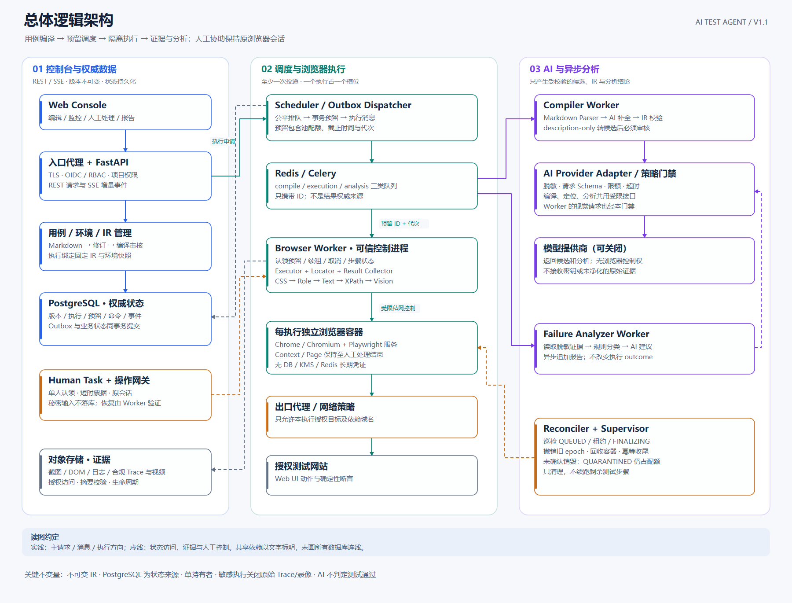
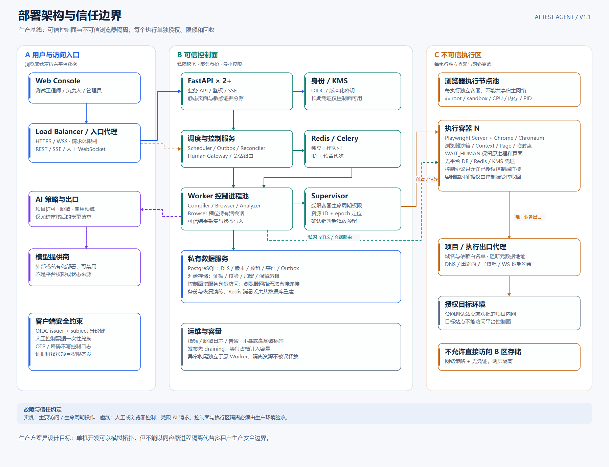

# AI Test Agent 架构图

基线：[详细设计 V1.1](../AI-Test-Agent-Detailed-Design.md) · [本轮审查记录](../AI-Test-Agent-Design-Review.md)  
日期：2026-09-29。图中组件均为设计目标，不代表已部署系统。

## 1. 总体逻辑架构



- [SVG 矢量图](./AI-Test-Agent-Architecture.svg)：放大、打印和放入评审材料。
- [PNG 图片](./AI-Test-Agent-Architecture.png)：直接预览与分享。
- [Mermaid 源文件](./AI-Test-Agent-Architecture.mmd)：调整组件及逻辑依赖。
- [独立 HTML 预览](./AI-Test-Agent-Architecture.html)：浏览器打开即可查看，无远程脚本。

左侧是控制台、版本管理与权威状态，中间是调度和浏览器执行，右侧是 AI 与故障收尾。人工通道连接原 Worker，不创建新浏览器继续执行；分析结果异步追加，不改变 outcome。

## 2. 部署与信任边界



- [SVG 矢量图](./AI-Test-Agent-Deployment.svg)
- [PNG 图片](./AI-Test-Agent-Deployment.png)
- [Mermaid 源文件](./AI-Test-Agent-Deployment.mmd)
- [独立 HTML 预览](./AI-Test-Agent-Deployment.html)

可信 Worker 控制进程拥有受限服务凭证；不可信浏览器在独立容器内，由 Supervisor 创建与回收，不能直接连接控制面数据库和密钥服务。生产必须验证网络隔离，不以独立 Context 代替容器与网络边界。

## 3. 图中关键合同

1. PostgreSQL 是业务状态来源；Redis 只负责传递工作消息。
2. 调度先事务预留，再投递执行；消息绑定 reservation_id/generation，旧消息不能占用新预留。
3. Worker 只持有一份有效执行租约；副作用结果未知时禁止自动重发操作。
4. Reconciler 可替代死亡 Worker 完成收尾，但不执行剩余测试步骤。
5. QUARANTINED 资源仍占配额；Supervisor 确认销毁后才释放。
6. AI 输入经过策略与脱敏门禁；AI 不能直接操控浏览器或修改通过结论。
7. SENSITIVE 执行关闭原始 Trace/录像；意外敏感接管后的录像不发布，Trace 不恢复。

图为了可读性省略部分共有存储和鉴权连线，Mermaid 图提供更完整的逻辑依赖。箭头不是每个网络请求的逐条记录；响应方向通常省略。

## 4. 重建与维护

SVG 为手工编排的确定性矢量布局，Mermaid 为语义源文件；两者不是自动互相转换。修改设计时应同步更新 Mermaid 与 [布局生成脚本](./build_diagrams.py)，再执行：

```powershell
python .\architecture\build_diagrams.py
.\architecture\render_diagrams.ps1
```

第一步仅依赖 Python 标准库，生成 SVG 与离线 HTML；第二步使用本机 Chrome 或 Edge 的 headless 模式将 HTML 导出为 PNG，并使用独立临时浏览器配置，不读取用户浏览器会话。PNG 是上述 SVG 的渲染结果。

本次校验包括 JSON 示例、源文档引用、SVG XML、图片尺寸及图片视觉检查；未运行被设计系统的功能、故障或性能测试。Mermaid 源文件未通过专用 Mermaid CLI 渲染器验证。
